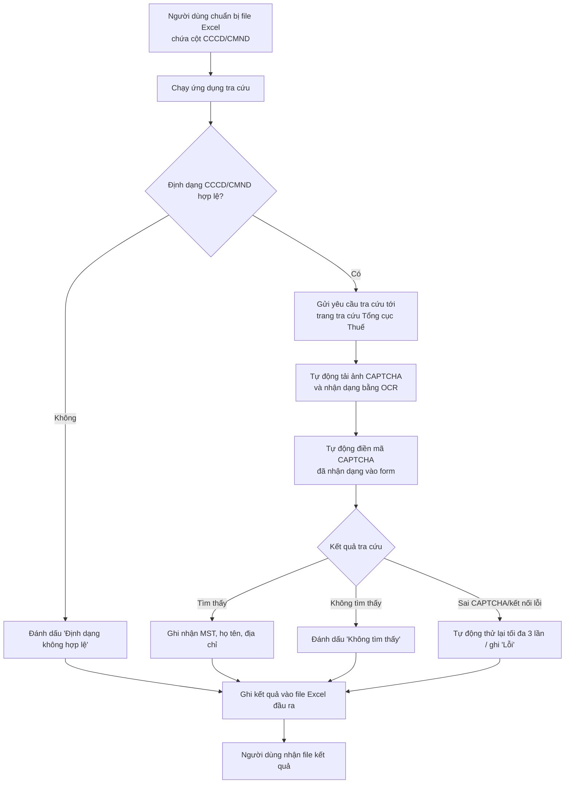

# Tài liệu yêu cầu nghiệp vụ (BRD): Ứng dụng tra cứu Mã số thuế cá nhân theo CCCD/CMND

| Thông tin tài liệu | Nội dung |
|---|---|
| Tên dự án | Ứng dụng tra cứu Mã số thuế cá nhân (MST) theo CCCD/CMND |
| Phiên bản | 1.0 |
| Ngày cập nhật | 2026-09-19 |
| Đối tượng đọc | Product Owner, Developer, Tester, người vận hành nghiệp vụ (kế toán/nhân sự) |

## 1. Giới thiệu

### 1.1. Mục đích tài liệu
Mô tả yêu cầu nghiệp vụ và yêu cầu hệ thống cho ứng dụng cho phép người dùng nội bộ nhập vào một danh sách số CCCD/CMND (dạng file Excel) và nhận lại thông tin mã số thuế cá nhân tương ứng, tra cứu từ hệ thống công khai của Tổng cục Thuế.

### 1.2. Phạm vi áp dụng
Tài liệu áp dụng cho đội phát triển (BA/Dev/QA) xây dựng công cụ nội bộ, phục vụ nhu cầu đối chiếu/bổ sung MST cho danh sách cá nhân (ví dụ: nhân viên, đối tác) đã có sẵn CCCD/CMND.

### 1.3. Bối cảnh nghiệp vụ
Bộ phận kế toán/nhân sự thường xuyên cần xác minh Mã số thuế cá nhân của người lao động/đối tác để phục vụ khai thuế TNCN. Hiện tại việc tra cứu đang thực hiện thủ công từng người một trên trang tra cứu của Tổng cục Thuế, tốn thời gian khi số lượng lớn. Ứng dụng này giúp tự động hoá toàn bộ quy trình, bao gồm cả việc tự động đọc và điền mã CAPTCHA, giảm tối đa thao tác thủ công của người dùng.

## 2. Đối tượng liên quan (Stakeholders)

| Vai trò | Trách nhiệm |
|---|---|
| Người dùng nghiệp vụ (kế toán/HR) | Chuẩn bị file Excel đầu vào, chạy ứng dụng, nhận file kết quả |
| Product Owner | Xác nhận yêu cầu, phê duyệt phạm vi |
| Developer | Xây dựng, kiểm thử ứng dụng theo tài liệu này |
| Tester | Kiểm thử chức năng và nghiệm thu theo tiêu chí đã định |

## 3. Phạm vi (Scope)

### 3.1. Trong phạm vi (In-scope)
- Đọc danh sách CCCD/CMND từ 1 cột trong file Excel do người dùng cung cấp.
- Tự động điền thông tin và gửi yêu cầu tra cứu tới trang tra cứu người nộp thuế cá nhân của Tổng cục Thuế: `https://tracuunnt.gdt.gov.vn/tcnnt/mstcn.jsp`.
- Tự động đọc ảnh CAPTCHA (OCR) và điền vào form tra cứu mà không cần người dùng nhập thủ công.
- Trả kết quả tra cứu (MST, họ tên, địa chỉ, cơ quan thuế quản lý) ra file Excel.
- Ghi nhận trạng thái xử lý cho từng bản ghi và log lịch sử tra cứu.

### 3.2. Ngoài phạm vi (Out-of-scope)
- Không sử dụng dịch vụ giải CAPTCHA bên thứ ba trả phí (thuê ngoài qua API); việc nhận dạng CAPTCHA được thực hiện nội bộ bằng mô hình/thư viện OCR cục bộ.
- Không lưu trữ, khai thác dữ liệu CCCD/CMND ngoài mục đích tra cứu MST của tổ chức.
- Không tích hợp trực tiếp với hệ thống nội bộ khác (kế toán, HRM) trong giai đoạn 1.
- Không hỗ trợ tra cứu MST tổ chức/doanh nghiệp (chỉ MST cá nhân).

## 4. Yêu cầu nghiệp vụ (Business Requirements)

| Mã | Yêu cầu nghiệp vụ |
|---|---|
| BR-01 | Người dùng cần tra cứu MST cho nhiều CCCD/CMND cùng lúc thay vì tra cứu từng người một trên web. |
| BR-02 | Người dùng cần biết rõ trạng thái từng bản ghi (tìm thấy/không tìm thấy/lỗi) để xử lý ngoại lệ thủ công. |
| BR-03 | Người dùng cần có thể tạm dừng và chạy tiếp mà không phải tra cứu lại từ đầu (tiết kiệm thời gian với danh sách lớn). |
| BR-04 | Việc tra cứu phải tuân thủ giới hạn hợp lý về tần suất để không ảnh hưởng/đứng trên ranh giới vi phạm điều khoản sử dụng của trang gdt.gov.vn. |
| BR-05 | Dữ liệu CCCD/CMND là dữ liệu cá nhân nhạy cảm, cần được xử lý và lưu trữ có kiểm soát, đúng phạm vi được phép của tổ chức. |
| BR-06 | Quy trình tra cứu cần được tự động hoá toàn phần, bao gồm bước đọc và điền mã CAPTCHA, để không cần người dùng đứng chờ thao tác thủ công trong lúc chạy. |

## 5. Quy trình nghiệp vụ (Business Process)



### Diễn giải luồng chính (Main flow)
1. Người dùng chuẩn bị file Excel đầu vào, chỉ định cột chứa CCCD/CMND.
2. Ứng dụng đọc và kiểm tra định dạng từng số.
3. Với mỗi số hợp lệ, ứng dụng mở trang tra cứu, điền số, tự động tải ảnh CAPTCHA và nhận dạng bằng OCR, sau đó tự điền mã đã nhận dạng vào form.
4. Ứng dụng gửi form và đọc kết quả trả về.
5. Kết quả (hoặc trạng thái lỗi) được lưu vào danh sách kết quả.
6. Sau khi xử lý xong toàn bộ danh sách (hoặc bị dừng giữa chừng), ứng dụng ghi ra file Excel đầu ra.

### Luồng ngoại lệ (Alternate/Exception flow)
- **Sai định dạng CCCD/CMND**: bỏ qua tra cứu, đánh dấu trạng thái tương ứng, không dừng toàn bộ tiến trình.
- **OCR nhận dạng CAPTCHA sai**: hệ thống tự động tải lại ảnh CAPTCHA mới và thử nhận dạng lại tối đa 3 lần; quá số lần cho phép thì đánh dấu "Lỗi" và chuyển sang bản ghi tiếp theo.
- **Mất kết nối/timeout**: tự động thử lại tối đa 2 lần; nếu vẫn lỗi, đánh dấu "Lỗi" và tiếp tục xử lý các bản ghi còn lại.
- **Ứng dụng bị dừng giữa chừng**: khi chạy lại, bỏ qua các bản ghi đã có kết quả từ lần chạy trước.

## 6. Yêu cầu chức năng (Functional Requirements)

| Mã | Mô tả | Độ ưu tiên |
|---|---|---|
| FR-01 | Cho phép người dùng chỉ định file Excel đầu vào, tên sheet và tên cột chứa CCCD/CMND | Bắt buộc |
| FR-02 | Kiểm tra định dạng CCCD (12 số) hoặc CMND (9 số) cho từng bản ghi, đánh dấu bản ghi sai định dạng | Bắt buộc |
| FR-03 | Tự động điền số CCCD/CMND vào form tra cứu tại `mstcn.jsp` | Bắt buộc |
| FR-04 | Tự động tải ảnh CAPTCHA, nhận dạng bằng OCR và tự điền mã đã nhận dạng vào ô mã xác nhận, không cần người dùng nhập thủ công | Bắt buộc |
| FR-05 | Gửi yêu cầu tra cứu và đọc kết quả trả về (MST, họ tên, địa chỉ, cơ quan thuế quản lý) | Bắt buộc |
| FR-06 | Ghi trạng thái xử lý cho từng bản ghi: `Thành công` / `Không tìm thấy` / `Lỗi` / `Định dạng không hợp lệ` | Bắt buộc |
| FR-07 | Xuất kết quả ra file Excel, giữ nguyên dữ liệu gốc kèm các cột kết quả bổ sung | Bắt buộc |
| FR-08 | Cho phép chạy lại và bỏ qua các bản ghi đã xử lý thành công trước đó (resume) | Nên có |
| FR-09 | Ghi log chi tiết từng lượt tra cứu (thời gian, số CCCD, kết quả, số lần thử lại CAPTCHA) vào file log | Nên có |
| FR-10 | Giới hạn tốc độ giữa các lượt tra cứu liên tiếp (delay cấu hình được) | Bắt buộc |
| FR-11 | Khi OCR nhận dạng CAPTCHA sai (submit thất bại do sai mã xác nhận), tự động tải lại ảnh CAPTCHA mới và thử lại tối đa 3 lần cho cùng một bản ghi | Bắt buộc |

## 7. Yêu cầu phi chức năng (Non-functional Requirements)

- **Hiệu năng**: đảm bảo khoảng cách tối thiểu 3–5 giây giữa 2 lượt tra cứu để tránh quá tải/bị chặn IP.
- **Độ tin cậy**: lỗi ở một bản ghi không được làm dừng toàn bộ quá trình xử lý danh sách.
- **Khả năng cấu hình**: đường dẫn file, tên cột, thời gian delay, số lần thử lại phải cấu hình được, không hard-code trong mã nguồn.
- **Bảo mật & tuân thủ dữ liệu cá nhân**: chỉ xử lý CCCD/CMND trong phạm vi cần thiết; không xuất/chia sẻ dữ liệu ra ngoài phạm vi được phép; tuân thủ quy định về bảo vệ dữ liệu cá nhân hiện hành.
- **Khả năng vận hành**: chạy được trên máy Windows của người dùng nghiệp vụ, cần trình duyệt Chrome/Edge cài sẵn.
- **Khả năng bảo trì**: mã nguồn tách module rõ ràng (đọc dữ liệu, tra cứu, bóc tách kết quả, xuất kết quả) để dễ chỉnh sửa khi trang tra cứu thay đổi giao diện.

## 8. Quy tắc nghiệp vụ (Business Rules)

- **BR-Rule-01**: Số CCCD hợp lệ có đúng 12 chữ số; số CMND hợp lệ có đúng 9 chữ số. Không đúng định dạng thì không được gửi đi tra cứu.
- **BR-Rule-02**: Mỗi lượt tra cứu bắt buộc phải có mã CAPTCHA được hệ thống tự động nhận dạng (OCR) và điền vào form; hệ thống không được bỏ qua bước này.
- **BR-Rule-03**: Không tra cứu lại một bản ghi đã có kết quả `Thành công` từ lần chạy trước, trừ khi người dùng chủ động yêu cầu tra cứu lại toàn bộ.
- **BR-Rule-04**: Giới hạn số lần thử lại nhận dạng CAPTCHA cho một bản ghi là 3 lần; vượt quá thì chuyển bản ghi sang trạng thái `Lỗi`.

## 9. Rủi ro, ràng buộc & giả định

### 9.1. Ràng buộc kỹ thuật
- Trang `mstcn.jsp` là trang HTML truyền thống, bắt buộc có CAPTCHA và không có API công khai chính thức.
- Phương án triển khai: dùng Selenium/Playwright điều khiển trình duyệt thật, tự động tải ảnh CAPTCHA (`captcha.png`) và dùng thư viện OCR cục bộ (ví dụ `ddddocr`, `Tesseract`, hoặc mô hình OCR huấn luyện riêng cho loại CAPTCHA của trang) để nhận dạng, sau đó tự điền vào form.
- Do CAPTCHA của trang có thể có độ nhiễu cao, độ chính xác OCR không đạt 100%; cần cơ chế thử lại (tải CAPTCHA mới + nhận dạng lại) khi submit thất bại do sai mã xác nhận.

### 9.2. Rủi ro
- Trang tra cứu có thể thay đổi cấu trúc HTML/form hoặc kiểu CAPTCHA bất kỳ lúc nào, làm ứng dụng ngừng hoạt động cho đến khi cập nhật lại logic bóc tách/mô hình OCR.
- Độ chính xác OCR nhận dạng CAPTCHA có thể thấp, dẫn đến nhiều lượt phải thử lại, làm giảm hiệu quả tự động hoá và tăng số lượng request tới máy chủ.
- Tra cứu với tần suất cao có thể bị chặn IP hoặc vi phạm điều khoản sử dụng của trang gdt.gov.vn.
- Rủi ro về bảo mật/tuân thủ nếu dữ liệu CCCD bị xử lý sai mục đích hoặc lộ ra ngoài.

### 9.3. Giả định
- Người dùng có quyền hợp pháp để tra cứu MST của các cá nhân trong danh sách đầu vào (ví dụ: nhân viên công ty, có sự đồng ý phù hợp).
- Máy chạy ứng dụng có kết nối Internet ổn định và đã cài trình duyệt Chrome/Edge.
- Số lượng bản ghi tra cứu mỗi lần ở quy mô vừa phải (hàng chục đến vài trăm), không phải hàng loạt quy mô lớn.

## 10. Tiêu chí nghiệm thu (Acceptance Criteria)

| STT | Kịch bản | Kết quả mong đợi |
|---|---|---|
| 1 | Nhập file Excel gồm 20 CCCD hợp lệ và 2 số sai định dạng | 20 số được tra cứu, 2 số bị đánh dấu "Định dạng không hợp lệ", không phát sinh crash |
| 2 | Dừng ứng dụng giữa chừng rồi chạy lại | Các bản ghi đã có kết quả không bị tra cứu lại |
| 3 | Chạy tra cứu cho 1 bản ghi hợp lệ, không có bất kỳ thao tác thủ công nào từ người dùng | Ứng dụng tự động tải ảnh CAPTCHA, nhận dạng bằng OCR, điền vào form và submit thành công mà không cần người dùng can thiệp |
| 4 | OCR nhận dạng sai CAPTCHA 3 lần liên tiếp cho 1 bản ghi | Bản ghi được đánh dấu "Lỗi", ứng dụng tự động chuyển sang bản ghi kế tiếp |
| 5 | Hoàn tất tra cứu toàn bộ danh sách | File Excel đầu ra có đủ cột: CCCD/CMND gốc, MST, Họ tên, Địa chỉ, Trạng thái |
| 6 | Kiểm tra file log sau khi chạy | Log ghi đầy đủ thời điểm, kết quả và số lần thử lại CAPTCHA của từng lượt tra cứu |

## 11. Thuật ngữ (Glossary)

| Thuật ngữ | Giải thích |
|---|---|
| MST | Mã số thuế |
| CCCD | Căn cước công dân (12 số) |
| CMND | Chứng minh nhân dân (9 số) |
| CAPTCHA | Cơ chế xác minh người dùng bằng ảnh ký tự để chống bot |
| OCR | Optical Character Recognition - công nghệ nhận dạng ký tự từ ảnh, dùng để tự động đọc mã CAPTCHA |
| Resume | Khả năng chạy tiếp một tiến trình bị gián đoạn mà không lặp lại công việc đã hoàn thành |

## 12. Phụ lục: Đề xuất kỹ thuật triển khai (tham khảo cho Developer)

- **Thư viện đề xuất**: `pandas`, `openpyxl` (đọc/ghi Excel); `selenium` + `webdriver-manager` (điều khiển trình duyệt); `beautifulsoup4` (bóc tách HTML); `ddddocr` hoặc `pytesseract` (nhận dạng CAPTCHA bằng OCR); `logging` (ghi log).
- **Cấu trúc thư mục đề xuất**:
  ```
  TraCuuMaSoThue/
  ├── ba-docs/
  │   └── thiet-ke-ung-dung-tra-cuu-mst.md
  ├── input/
  │   └── danh_sach_cccd.xlsx
  ├── output/
  │   └── ket_qua_tra_cuu.xlsx
  ├── src/
  │   ├── doc_du_lieu.py        # đọc & chuẩn hoá Excel đầu vào
  │   ├── tra_cuu_gdt.py        # tự động hoá Selenium + tra cứu
  │   ├── parse_ket_qua.py      # bóc tách HTML kết quả
  │   └── ghi_ket_qua.py        # ghi Excel đầu ra
  ├── main.py                   # điểm chạy chính, điều phối luồng
  └── requirements.txt
  ```
- Chi tiết thiết kế kỹ thuật (module hoá, xử lý lỗi, luồng code) sẽ được mô tả trong tài liệu thiết kế kỹ thuật (TDD) riêng, dựa trên các yêu cầu tại mục 4–8 của tài liệu này.
