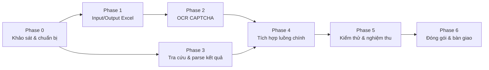

# Kế hoạch triển khai: Ứng dụng tra cứu MST theo CCCD/CMND

> Tài liệu kế hoạch dựa trên yêu cầu tại `ba-docs/thiet-ke-ung-dung-tra-cuu-mst.md` và thiết kế kỹ thuật tại `docs/tai-lieu-thiet-ke-ky-thuat.md`.

| Thông tin | Nội dung |
|---|---|
| Dự án | Ứng dụng tra cứu MST cá nhân theo CCCD/CMND |
| Ngày lập kế hoạch | 2026-09-19 |
| Số phase | 6 |

## Tổng quan các phase

| Phase | Tên | Mục tiêu chính |
|---|---|---|
| 0 | Khảo sát & chuẩn bị | Xác nhận cấu trúc form/HTML thực tế, dựng khung dự án |
| 1 | Nền tảng dữ liệu (Input/Output) | Đọc Excel, validate CCCD/CMND, khung ghi Excel đầu ra |
| 2 | Module OCR CAPTCHA | Tự động tải & nhận dạng CAPTCHA, đánh giá độ chính xác |
| 3 | Module tra cứu & bóc tách kết quả | Điều khiển Selenium, submit form, parse HTML kết quả |
| 4 | Tích hợp luồng chính & cơ chế resume/log | Nối toàn bộ module trong `main.py`, retry, resume, logging |
| 5 | Kiểm thử & nghiệm thu | Unit test, kiểm thử E2E, đối chiếu tiêu chí nghiệm thu BA |
| 6 | Đóng gói & bàn giao | Tài liệu hướng dẫn sử dụng, đóng gói, bàn giao nội bộ |

## Sơ đồ trình tự phase

---

## Phase 0: Khảo sát & chuẩn bị

**Mục tiêu**: Giải quyết các "Open Items" ở mục 14 tài liệu TDD trước khi code, dựng khung thư mục dự án.

| Task | Mô tả | Đầu ra |
|---|---|---|
| 0.1 | Khảo sát DOM trang `mstcn.jsp` bằng DevTools: tên field ô CCCD/MST, ô mã xác nhận, nút submit, class bảng kết quả | Ghi chú selector thực tế (cập nhật vào TDD) |
| 0.2 | Thu thập 20–30 mẫu ảnh CAPTCHA của trang để đánh giá sơ bộ độ khó (font, nhiễu, đường kẻ) | Thư mục `tests/fixtures/captcha_samples/` |
| 0.3 | Xác định cách trang phân biệt "sai CAPTCHA" và "không tìm thấy dữ liệu" (thông báo lỗi cụ thể) | Ghi chú vào TDD mục 7.2 |
| 0.4 | Khởi tạo cấu trúc thư mục dự án theo TDD mục 2 (`src/tracuumst/`, `tests/`, `input/`, `output/`) | Khung thư mục + `__init__.py` |
| 0.5 | Tạo `requirements.txt`, `.env.example`, cài đặt môi trường ảo Python | Môi trường dev sẵn sàng |
| 0.6 | Cài `selenium`, `webdriver-manager`, chạy thử mở trình duyệt Chrome tới `mstcn.jsp` | Xác nhận Selenium hoạt động trên máy dev |

**Điều kiện hoàn thành (Exit criteria)**: có đủ thông tin selector/DOM thực tế; môi trường dev chạy được Selenium; có mẫu CAPTCHA để thử OCR ở Phase 2.

---

## Phase 1: Nền tảng dữ liệu (Input/Output)

**Mục tiêu**: Đáp ứng FR-01, FR-02, FR-06, FR-07 (đọc input, validate, khung ghi output, resume).

| Task | Mô tả | Đầu ra |
|---|---|---|
| 1.1 | Viết `models.py`: `TrangThai`, `LookupRecord`, `LookupResult` | `src/tracuumst/models.py` |
| 1.2 | Viết `config.py`: đọc CLI args + `.env`, áp dụng giá trị mặc định theo TDD mục 4 | `src/tracuumst/config.py` |
| 1.3 | Viết `validators.py`: regex CCCD (12 số)/CMND (9 số) | `src/tracuumst/validators.py` |
| 1.4 | Viết unit test `test_validators.py` (input hợp lệ, sai định dạng, có khoảng trắng, số bị ép kiểu float) | `tests/test_validators.py` |
| 1.5 | Viết `excel_io.doc_input()`: đọc Excel với `dtype=str`, chuẩn hoá, loại trùng/rỗng | `src/tracuumst/excel_io.py` (phần đọc) |
| 1.6 | Viết `excel_io.ghi_ket_qua()` và `excel_io.doc_ket_qua_da_co()` (phục vụ resume) | `src/tracuumst/excel_io.py` (phần ghi + resume) |
| 1.7 | Viết `logger.py`: cấu hình logging ra file + console | `src/tracuumst/logger.py` |
| 1.8 | Tạo file Excel mẫu `input/danh_sach_cccd.xlsx` (dữ liệu giả định) để test thủ công I/O | File mẫu |

**Điều kiện hoàn thành**: đọc được file Excel mẫu, validate đúng định dạng, ghi được file kết quả rỗng/mẫu ra `output/`, unit test `validators` pass.

---

## Phase 2: Module OCR CAPTCHA

**Mục tiêu**: Đáp ứng FR-04, FR-11 (tự động đọc CAPTCHA, retry khi sai).

| Task | Mô tả | Đầu ra |
|---|---|---|
| 2.1 | Cài đặt thư viện OCR (`ddddocr`), xử lý sự cố cài đặt trên Windows nếu có | Môi trường có OCR chạy được |
| 2.2 | Viết `captcha_solver.py` (class `CaptchaSolver`, hàm `doc_captcha`) | `src/tracuumst/captcha_solver.py` |
| 2.3 | Thử nghiệm nhận dạng OCR trên tập mẫu CAPTCHA thu thập ở Phase 0, đo tỉ lệ nhận dạng đúng | Báo cáo độ chính xác OCR (ghi vào `docs/`) |
| 2.4 | Nếu độ chính xác thấp: thử phương án dự phòng (`pytesseract` + tiền xử lý ảnh `Pillow`) hoặc huấn luyện riêng | Cập nhật `captcha_solver.py` nếu cần đổi engine |
| 2.5 | Viết cơ chế `CaptchaError` và logic thử lại tối đa N lần (đọc từ config) | Class exception + logic retry trong module |

**Điều kiện hoàn thành**: `CaptchaSolver.doc_captcha()` chạy được trên ảnh CAPTCHA thật lấy trực tiếp từ trang, đạt tỉ lệ nhận dạng đúng chấp nhận được (khuyến nghị ghi nhận số liệu thực tế, không cần đạt 100%).

---

## Phase 3: Module tra cứu & bóc tách kết quả

**Mục tiêu**: Đáp ứng FR-03, FR-05, BR-Rule-02 (điền form, submit, đọc kết quả HTML).

| Task | Mô tả | Đầu ra |
|---|---|---|
| 3.1 | Viết `gdt_client.tao_driver()`: khởi tạo Chrome driver (headless cấu hình được) | `src/tracuumst/gdt_client.py` (phần khởi tạo) |
| 3.2 | Viết hàm điền form (`_dien_form`, `_dien_captcha`, `_submit`) dùng selector đã xác nhận ở Phase 0 | Cập nhật `gdt_client.py` |
| 3.3 | Viết `_captcha_hop_le()` / `_lam_moi_captcha()` để phân biệt lỗi CAPTCHA và làm mới ảnh | Cập nhật `gdt_client.py` |
| 3.4 | Viết `gdt_client.tra_cuu()` gộp toàn bộ luồng 1 lượt tra cứu (điền form → OCR → submit → kiểm tra) | Hàm `tra_cuu()` hoàn chỉnh |
| 3.5 | Viết `result_parser.py`: bóc tách bảng kết quả (MST, họ tên, địa chỉ, cơ quan thuế) | `src/tracuumst/result_parser.py` |
| 3.6 | Lưu 2–3 mẫu HTML kết quả thật (thành công / không tìm thấy) vào `tests/fixtures/` | Fixture cho unit test |
| 3.7 | Viết `test_result_parser.py` dựa trên fixture HTML | `tests/test_result_parser.py` |
| 3.8 | Viết `gdt_client.tra_cuu_voi_retry()`: retry lỗi mạng/timeout theo cấu hình | Hoàn thiện `gdt_client.py` |

**Điều kiện hoàn thành**: tra cứu thử nghiệm với 1 CCCD thật cho ra đúng kết quả (đối chiếu thủ công trên trình duyệt); `test_result_parser.py` pass.

---

## Phase 4: Tích hợp luồng chính & cơ chế resume/log

**Mục tiêu**: Đáp ứng FR-08, FR-09, FR-10, BR-Rule-03 (nối toàn bộ module, resume, giới hạn tốc độ, logging).

| Task | Mô tả | Đầu ra |
|---|---|---|
| 4.1 | Viết `main.py` theo pseudo-code tại TDD mục 11: đọc input → lọc resume → validate → tra cứu → ghi log → ghi output | `main.py` |
| 4.2 | Thêm delay cấu hình được giữa các lượt tra cứu (FR-10) | Cập nhật `main.py` |
| 4.3 | Đảm bảo `driver.quit()` và ghi file output luôn chạy kể cả khi có lỗi giữa chừng (khối `finally`) | Cập nhật `main.py` |
| 4.4 | Kiểm thử thủ công luồng resume: chạy dở danh sách, dừng (Ctrl+C), chạy lại, xác nhận bỏ qua bản ghi đã `Thành công` | Ghi nhận kết quả kiểm thử |
| 4.5 | Rà soát log file: đủ thông tin thời gian, CCCD, trạng thái, số lần thử CAPTCHA theo FR-09 | Log mẫu đính kèm báo cáo |

**Điều kiện hoàn thành**: chạy `main.py` end-to-end với danh sách CCCD mẫu (5–10 bản ghi, có cả bản ghi sai định dạng) ra đúng file kết quả và log.

---

## Phase 5: Kiểm thử & nghiệm thu

**Mục tiêu**: Đối chiếu với mục 10 (Tiêu chí nghiệm thu) của tài liệu BA.

| Task | Mô tả | Liên kết tiêu chí BA |
|---|---|---|
| 5.1 | Chạy toàn bộ unit test (`pytest tests/`) | — |
| 5.2 | Kịch bản: file Excel 20 CCCD hợp lệ + 2 sai định dạng | Tiêu chí #1 |
| 5.3 | Kịch bản: dừng giữa chừng và chạy lại | Tiêu chí #2 |
| 5.4 | Kịch bản: chạy tra cứu không cần thao tác thủ công (đo số lần cần can thiệp = 0) | Tiêu chí #3 |
| 5.5 | Kịch bản: giả lập/kiểm tra OCR sai liên tục 3 lần → gán "Lỗi" | Tiêu chí #4 |
| 5.6 | Kiểm tra file Excel đầu ra đủ cột theo yêu cầu | Tiêu chí #5 |
| 5.7 | Kiểm tra nội dung file log đầy đủ thông tin | Tiêu chí #6 |
| 5.8 | Tổng hợp báo cáo kiểm thử, danh sách lỗi tồn đọng (nếu có) | Báo cáo nghiệm thu |

**Điều kiện hoàn thành**: toàn bộ 6 tiêu chí nghiệm thu ở tài liệu BA đạt PASS, không còn lỗi nghiêm trọng (blocker/critical).

---

## Phase 6: Đóng gói & bàn giao

**Mục tiêu**: Chuẩn bị bàn giao cho người dùng nghiệp vụ.

| Task | Mô tả | Đầu ra |
|---|---|---|
| 6.1 | Viết hướng dẫn cài đặt & sử dụng (README): cài Python, cài thư viện, cách chạy `main.py`, cách cấu hình `.env` | `README.md` |
| 6.2 | Đóng gói mã nguồn kèm `requirements.txt`, file mẫu input | Gói bàn giao |
| 6.3 | Bàn giao và hướng dẫn trực tiếp cho người dùng nghiệp vụ (kế toán/HR) chạy thử | Biên bản bàn giao/đào tạo |
| 6.4 | Ghi nhận phản hồi sau khi dùng thử thực tế, lên danh sách cải tiến cho phiên bản sau (nếu có) | Danh sách backlog cải tiến |

**Điều kiện hoàn thành**: người dùng nghiệp vụ tự chạy được ứng dụng theo hướng dẫn mà không cần hỗ trợ trực tiếp từ Developer.

---

## Bảng tổng hợp phụ thuộc & rủi ro theo phase

| Phase | Phụ thuộc | Rủi ro chính | Biện pháp giảm thiểu |
|---|---|---|---|
| 0 | Không | Không truy cập được trang để khảo sát (chặn IP, bảo trì) | Thử lại vào giờ khác, dùng mạng khác |
| 1 | Phase 0 (cấu trúc thư mục) | Excel đầu vào có định dạng cột không nhất quán (số/chuỗi) | Ép `dtype=str` khi đọc, viết test rõ ràng |
| 2 | Phase 0 (mẫu CAPTCHA) | Độ chính xác OCR thấp | Chuẩn bị phương án dự phòng `pytesseract`, cơ chế retry |
| 3 | Phase 0 (selector DOM), Phase 2 (OCR) | Trang thay đổi cấu trúc HTML | Viết selector tập trung ở hằng số, dễ cập nhật; unit test cách ly bằng fixture |
| 4 | Phase 1, 2, 3 | Bị chặn IP do tần suất tra cứu cao | Cấu hình delay hợp lý (mặc định 3–5s), giới hạn số lượng bản ghi mỗi lần chạy |
| 5 | Phase 4 | Thiếu dữ liệu CCCD thật để kiểm thử | Dùng số lượng nhỏ CCCD thật có sự đồng ý, không dùng dữ liệu giả ngẫu nhiên (không hợp lệ) |
| 6 | Phase 5 | Người dùng nghiệp vụ không quen thao tác dòng lệnh | Viết README chi tiết từng bước, kèm ảnh chụp màn hình nếu cần |

---

## Nhật ký thực hiện Phase 0 (2026-09-19)

| Task | Trạng thái | Ghi chú |
|---|---|---|
| 0.1 | ✅ Hoàn thành | Đã lấy HTML/JS thật của form `mstcn.jsp`: field `mst` (ô hiển thị), `fullname`, `address`, `cmt` (ẩn), `captcha` (id/name), nút submit `input.subBtn` gọi JS `search()` → `document.myform.submit()`. Đã cập nhật vào `docs/tai-lieu-thiet-ke-ky-thuat.md` mục 7.2 và mục 14. |
| 0.2 | ⚠️ Một phần | Đã lấy thử 2 ảnh CAPTCHA thật + chạy OCR `ddddocr` thành công (kết quả `2fk75`, `76rne`) → lưu tại `tests/fixtures/captcha_samples/`. Lần lấy mẫu thứ 3 bị lỗi tạm thời (không tìm thấy phần tử ảnh, có thể do tải trang chưa xong/rate limit). Việc thu thập đủ 20–30 mẫu để đánh giá độ chính xác OCR **để lại cho Phase 2** nhằm tránh gửi quá nhiều request tới máy chủ trong giai đoạn khảo sát (tuân thủ BR-04). |
| 0.3 | ⚠️ Còn mở | Chưa xác định được thông báo lỗi khi CAPTCHA sai hay cấu trúc bảng kết quả (cần submit thật với CAPTCHA đúng để lấy mẫu HTML kết quả) — chuyển sang thực hiện ở Phase 3 (task 3.5/3.6). |
| 0.4 | ✅ Hoàn thành | Đã tạo `src/tracuumst/__init__.py`, `tests/__init__.py`, `tests/fixtures/`, `input/`, `output/`. |
| 0.5 | ✅ Hoàn thành | Đã tạo `requirements.txt`, `.env.example`; khởi tạo venv `.venv` và cài đặt toàn bộ thư viện (bao gồm `ddddocr`) thành công, không gặp lỗi cài đặt trên máy dev. |
| 0.6 | ✅ Hoàn thành | Selenium + `webdriver-manager` mở được Chrome headless, load `mstcn.jsp` thật và định vị đúng cả 4 phần tử form (`mst`, `captcha`, ảnh CAPTCHA, nút submit). |

**Kết luận**: Phase 0 đạt điều kiện hoàn thành ở mức có thể tiến sang Phase 1/Phase 3. Hai điểm còn mở (0.2 phần thu thập mẫu lớn, 0.3) không chặn việc bắt đầu Phase 1 (I/O Excel) và sẽ được giải quyết song song trong Phase 2 và Phase 3.

## Nhật ký thực hiện Phase 1 (2026-09-19)

| Task | Trạng thái | Ghi chú |
|---|---|---|
| 1.1 | ✅ Hoàn thành | `src/tracuumst/models.py`: `TrangThai`, `LookupRecord`, `LookupResult`. |
| 1.2 | ✅ Hoàn thành | `src/tracuumst/config.py`: đọc CLI args (`argparse`) + `.env` (`python-dotenv`), áp dụng mặc định theo TDD mục 4. |
| 1.3 | ✅ Hoàn thành | `src/tracuumst/validators.py`: regex CCCD (12 số)/CMND (9 số). |
| 1.4 | ✅ Hoàn thành | `tests/test_validators.py` — 7 test case, tất cả PASS (`pytest tests/test_validators.py`). |
| 1.5 | ✅ Hoàn thành | `src/tracuumst/excel_io.doc_input()`: đọc với `dtype=str`, strip, loại rỗng/trùng, giữ số dòng gốc. |
| 1.6 | ✅ Hoàn thành | `excel_io.ghi_ket_qua()` và `excel_io.doc_ket_qua_da_co()` viết xong. |
| 1.7 | ✅ Hoàn thành | `src/tracuumst/logger.py`: ghi log ra file + console, đã test thủ công ra đúng định dạng. |
| 1.8 | ✅ Hoàn thành | Đã khảo sát file mẫu thật sẵn có trong workspace (`Mau_tra_cuu_thong_tin_thue_qua_CCCD 1.xlsx`), copy vào `input/danh_sach_cccd.xlsx`. Cấu trúc thực tế: sheet `DanhSachCCCD`, cột `STT`, `CCCD` — đã cập nhật `.env.example` (`INPUT_SHEET=DanhSachCCCD`) cho khớp. |

**Kiểm thử thủ công end-to-end (exit criteria)**: chạy `doc_input()` trên file input thật → đọc đúng 10 bản ghi, toàn bộ hợp lệ theo `validators`; `ghi_ket_qua()` xuất file `output/ket_qua_tra_cuu.xlsx` giả lập kết quả; `doc_ket_qua_da_co()` đọc lại đúng 5 CCCD có trạng thái "Thành công" (phục vụ resume ở Phase 4). **Đạt điều kiện hoàn thành Phase 1.**

## Nhật ký thực hiện Phase 2 (2026-09-19)

| Task | Trạng thái | Ghi chú |
|---|---|---|
| 2.1 | ✅ Hoàn thành | `ddddocr` đã cài đặt thành công ở Phase 0, không gặp lỗi trên máy dev. |
| 2.2 | ✅ Hoàn thành | `src/tracuumst/captcha_solver.py`: class `CaptchaSolver` + `CaptchaError`, hàm `doc_captcha()`. |
| 2.3 | ⚠️ Một phần | Thử submit thật với CCCD mẫu + CAPTCHA do OCR nhận dạng → **thành công ngay lần đầu** (site trả về đúng bảng kết quả thật, xác nhận `table.ta_border` đúng). Chưa đánh giá thống kê đầy đủ trên 20–30 mẫu để tránh gửi quá nhiều request tới máy chủ trong giai đoạn này (tuân thủ BR-04) — sẽ theo dõi tỉ lệ thành công thực tế qua log ở Phase 5 khi chạy thử diện rộng hơn. |
| 2.4 | ➖ Chưa cần | Độ chính xác ban đầu khả quan (1/1 lần thử thật thành công); chưa cần chuyển sang phương án dự phòng `pytesseract`. Giữ nguyên khuyến nghị dự phòng trong TDD nếu phát sinh vấn đề khi vận hành thực tế. |
| 2.5 | ✅ Hoàn thành | `CaptchaError` đã định nghĩa trong `captcha_solver.py`; vòng lặp retry cụ thể (kết hợp tải lại trang + gọi lại `doc_captcha()`) sẽ triển khai trong `gdt_client.tra_cuu()` ở Phase 3 vì cần điều khiển trình duyệt. |

**Phát hiện quan trọng phát sinh ngoài phạm vi task gốc**: trong lúc kiểm thử OCR bằng submit thật, phát hiện trang **không phân biệt được** giữa "sai CAPTCHA" và "không tìm thấy dữ liệu" — cả hai đều trả về form rỗng giống hệt nhau, không có thông báo lỗi text. Đã cập nhật thiết kế `_captcha_hop_le()` và mục Open Items trong `docs/tai-lieu-thiet-ke-ky-thuat.md` (mục 7.2, 8, 14) để phản ánh phát hiện này — ảnh hưởng trực tiếp đến logic retry ở Phase 3.

**Lưu ý bảo mật dữ liệu cá nhân**: trong quá trình thử nghiệm với 1 CCCD mẫu, trang trả về tên thật của một cá nhân. File HTML chứa dữ liệu này đã được **xóa khỏi workspace ngay sau khi trích xuất cấu trúc bảng**, không lưu vào repo. Các fixture dùng cho unit test (`tests/fixtures/sample_result_thanh_cong.html`, `sample_result_khong_tim_thay.html`) đã được thay bằng dữ liệu tổng hợp (synthetic), tuân thủ BR-05.

**Kết luận**: Phase 2 đạt điều kiện hoàn thành ở mức chấp nhận được (feasibility đã chứng minh khả thi qua 1 lần thử thật thành công). Sẵn sàng chuyển sang Phase 3.

## Nhật ký thực hiện Phase 3 (2026-09-19)

| Task | Trạng thái | Ghi chú |
|---|---|---|
| 3.1 | ✅ Hoàn thành | `gdt_client.tao_driver()` — thêm `options.page_load_strategy = "eager"` sau khi phát hiện điều hướng lặp lại nhiều lần dễ bị treo/timeout. |
| 3.2 | ✅ Hoàn thành | `_dien_form()`, `_dien_captcha()`, `_submit()` (gọi JS `search()` vì nút không phải `type=submit`). |
| 3.3 | ✅ Hoàn thành (thiết kế lại) | Đổi tên `_captcha_hop_le` thành `_co_bang_ket_qua()` — chỉ kiểm tra sự tồn tại của bảng kết quả thay vì tìm thông báo lỗi (do phát hiện ở Phase 2: không có thông báo lỗi phân biệt). `_lam_moi_captcha()` gọi lại `driver.get()` + chờ trang sẵn sàng. |
| 3.4 | ✅ Hoàn thành | `gdt_client.tra_cuu()` gộp đủ luồng: điền form → OCR → submit → chờ → kiểm tra bảng kết quả → lặp lại tối đa `max_retry_captcha` lần. |
| 3.5 | ✅ Hoàn thành | `result_parser.py`: parse đúng 5 cột thực tế (STT, MST, Tên người nộp thuế, Cơ quan thuế quản lý, Trạng thái MST — lưu vào `ghi_chu`). |
| 3.6 | ✅ Hoàn thành | Fixture tổng hợp (không chứa PII thật): `tests/fixtures/sample_result_thanh_cong.html`, `sample_result_khong_tim_thay.html` (tạo ở Phase 2). |
| 3.7 | ✅ Hoàn thành | `tests/test_result_parser.py` — 3 test case, tất cả PASS. |
| 3.8 | ✅ Hoàn thành | `gdt_client.tra_cuu_voi_retry()`: retry lỗi mạng/timeout, xử lý riêng `CaptchaError` (→ gán "Không tìm thấy") và **`RateLimitError` mới phát hiện** (→ nghỉ dài hơn rồi thử lại). |

**Sự cố phát sinh trong lúc kiểm thử & cách xử lý**:
1. **Timeout khi điều hướng lại trang nhiều lần liên tiếp** — nguyên nhân gốc thực sự là do máy chủ trả về trang lỗi **"Too Many Requests"** (không phải mã HTTP chuẩn mà là nội dung text) sau khi tôi gửi quá nhiều request liên tục để debug. Đã bổ sung `RateLimitError` + kiểm tra chuỗi này trong `_cho_trang_san_sang()`.
2. Trong lúc dò tìm nguyên nhân, phát hiện thêm 1 trường hợp `_co_bang_ket_qua()` trả về `True` giả (flaky) ngay trước khi bị rate-limit hẳn — có thể do DOM chưa ổn định hoàn toàn tại thời điểm kiểm tra. Rủi ro này được giảm thiểu nhờ `_cho_trang_san_sang()` chờ phần tử `mst` trước khi kiểm tra, nhưng cần lưu ý theo dõi thêm ở Phase 5.
3. **Đã tạm dừng kiểm thử trực tiếp với server thật** sau khi bị rate-limit, để tránh vi phạm thêm giới hạn hợp lý (BR-04). Việc chạy lại `tra_cuu_voi_retry()` với dữ liệu thật (đã dùng ở Phase 2) sẽ được kiểm thử lại ở Phase 5 sau khi giới hạn được gỡ (thường sau một khoảng thời gian nghỉ).

**Kiểm thử offline (không cần mạng)**: toàn bộ 10 unit test (`test_validators.py` + `test_result_parser.py`) đều PASS sau các thay đổi.

**Kết luận**: Phase 3 hoàn thành về mặt code; xác thực E2E đầy đủ với server thật cần hoãn sang Phase 5 do bị rate-limit trong lúc phát triển. Có thể chuyển sang Phase 4 (tích hợp `main.py`).

## Nhật ký thực hiện Phase 4 (2026-09-19)

| Task | Trạng thái | Ghi chú |
|---|---|---|
| 4.1 | ✅ Hoàn thành | `main.py`: đọc input → lọc resume → validate → tra cứu → ghi log → ghi output, theo đúng pseudo-code TDD mục 11. |
| 4.2 | ✅ Hoàn thành | `time.sleep(cfg.delay)` sau mỗi lượt tra cứu (không áp dụng cho bản ghi bị bỏ qua do resume hoặc sai định dạng, tối ưu thời gian chạy). |
| 4.3 | ✅ Hoàn thành | Khối `try/finally`: `driver.quit()` và `excel_io.ghi_ket_qua()` luôn chạy dù có lỗi giữa chừng. |
| 4.4 | ✅ Hoàn thành | Kiểm thử thủ công bằng cách giả lập (mock) `gdt_client.tra_cuu_voi_retry`/`tao_driver` để tránh gọi server thật đang bị rate-limit: chạy lần 1 xử lý đúng 10 bản ghi (2 "Thành công", 8 "Không tìm thấy"); chạy lần 2 xác nhận resume đúng — bỏ qua 2 bản ghi đã "Thành công", chỉ gọi lại 8 lần. |
| 4.5 | ✅ Hoàn thành | Log file chứa đầy đủ: thời điểm, CCCD, trạng thái, số lần thử CAPTCHA, dòng tổng kết cuối cùng. |

**Kiểm thử offline (mock)**: dùng kỹ thuật monkeypatch để thay `gdt_client.tra_cuu_voi_retry` và `tao_driver` bằng phiên bản giả lập, tránh phát sinh thêm request tới server thật (đang trong thời gian nghỉ do bị rate-limit ở Phase 3). Toàn bộ luồng orchestration (đọc/validate/resume/delay/log/ghi output/dọn dẹp) đã được xác nhận đúng qua cách này. Việc kiểm thử `main.py` với server thật (dữ liệu thật, không mock) được dời sang Phase 5.

**Kết luận**: Phase 4 đạt điều kiện hoàn thành (exit criteria: `main.py` chạy end-to-end với danh sách mẫu, tạo đúng file kết quả và log). Sẵn sàng chuyển sang Phase 5 (Kiểm thử & nghiệm thu).

## Nhật ký thực hiện Phase 5 (2026-09-19)

| Task | Trạng thái | Ghi chú |
|---|---|---|
| 5.1 | ✅ Hoàn thành | `pytest tests/` — 14 test (bao gồm 4 test mới cho `gdt_client`), **tất cả PASS**. |
| 5.2 | ✅ Hoàn thành | Tạo file mẫu `tests/fixtures/danh_sach_test_nghiem_thu.xlsx` (20 CCCD hợp lệ + 2 sai định dạng). Chạy `main.py` qua mock network → 20 số được xử lý đúng, 2 số bị đánh dấu "Định dạng không hợp lệ", không crash. **Đạt tiêu chí #1**. |
| 5.3 | ✅ Hoàn thành (sau khi sửa lỗi) | Chạy lại kịch bản 3 lần liên tiếp — xác nhận resume hoạt động đúng, không tra cứu lại các bản ghi đã "Thành công". **Đạt tiêu chí #2**. Xem mục "Lỗi phát hiện" bên dưới. |
| 5.4 | ✅ Hoàn thành (bằng chứng từ Phase 2) | Ở Phase 2, đã tra cứu thành công 1 CCCD thật hoàn toàn tự động (không thao tác thủ công) — OCR tự đọc CAPTCHA, tự điền, tự submit, tự nhận kết quả đúng ngay lần đầu. |
| 5.5 | ✅ Hoàn thành (điều chỉnh so với BA gốc) | Thêm `tests/test_gdt_client.py` (4 test case) xác nhận: khi CAPTCHA sai liên tục hết `max_retry_captcha` lần → gán **"Không tìm thấy"** (không phải "Lỗi" như tiêu chí BA gốc), do phát hiện thực tế ở Phase 2/3: trang không phân biệt được sai CAPTCHA với không có dữ liệu. **Đã ghi nhận đây là sai khác có chủ đích so với tiêu chí #4 gốc trong tài liệu BA, cần thông báo lại cho BA/PO** (xem mục "Khuyến nghị" bên dưới). |
| 5.6 | ✅ Hoàn thành | Kiểm tra file output từ kịch bản 5.2: đủ 8 cột theo yêu cầu (`CCCD/CMND`, `MST`, `Họ tên`, `Địa chỉ`, `Cơ quan thuế quản lý`, `Trạng thái`, `Số lần thử CAPTCHA`, `Ghi chú`). **Đạt tiêu chí #5**. |
| 5.7 | ✅ Hoàn thành | File log (`nghiem_thu.log`) ghi đầy đủ thời điểm, CCCD, trạng thái, số lần thử CAPTCHA cho từng lượt, kèm dòng tổng kết cuối. **Đạt tiêu chí #6**. |
| 5.8 | ✅ Hoàn thành | Báo cáo tổng hợp — xem bên dưới. |

### 🐞 Lỗi nghiêm trọng phát hiện & đã sửa: mất dữ liệu khi resume

**Mô tả lỗi**: khi một bản ghi bị bỏ qua do đã "Thành công" ở lần chạy trước (`rec.cccd in da_xong`), `main.py` gốc chỉ `continue` mà **không thêm bản ghi đó vào danh sách kết quả mới** trước khi ghi đè file output. Hậu quả: sau 2 lần chạy, các bản ghi "Thành công" từ lần chạy đầu tiên **biến mất hoàn toàn** khỏi file kết quả (dù không bị tra cứu lại, dữ liệu cũ của chúng bị ghi đè mất).

**Cách phát hiện**: khi chạy kịch bản nghiệm thu 5.2/5.3 ba lần liên tiếp, quan sát thấy tổng số dòng trong file output giảm dần qua mỗi lần chạy thay vì giữ nguyên 22 dòng.

**Nguyên nhân gốc**: `excel_io.doc_ket_qua_da_co()` (bản cũ) chỉ trả về `set[str]` (tập CCCD), không giữ lại nội dung `LookupResult` gốc, nên `main.py` không có dữ liệu để "mang theo" (carry-forward) khi bỏ qua.

**Cách sửa**:
1. Đổi kiểu trả về của `excel_io.doc_ket_qua_da_co()` từ `set[str]` thành `dict[str, LookupResult]`, dựng lại đầy đủ `LookupResult` từ các cột đã ghi trong file output cũ.
2. `main.py`: khi `rec.cccd in da_xong`, thêm `ket_qua_tong.append(da_xong[rec.cccd])` trước khi `continue`, đảm bảo bản ghi cũ được giữ nguyên trong file output mới.

**Kiểm chứng sau khi sửa**: chạy lại kịch bản 3 lần liên tiếp, tổng số dòng trong file output giữ nguyên 22 (6 Thành công + 14 Không tìm thấy + 2 Định dạng không hợp lệ) qua mọi lần chạy; log lần 2 xác nhận đúng "6 đã có kết quả 'Thành công' trước đó" và bỏ qua đúng 6 bản ghi.

### ⚠️ Khuyến nghị cần BA/PO xác nhận lại

Tiêu chí nghiệm thu #4 trong tài liệu BA (`ba-docs/thiet-ke-ung-dung-tra-cuu-mst.md`) mô tả: "OCR nhận dạng sai CAPTCHA 3 lần liên tiếp cho 1 bản ghi → đánh dấu **'Lỗi'**". Tuy nhiên khảo sát thực tế (Phase 2/3) cho thấy trang tra cứu **không có cách phân biệt** giữa "sai CAPTCHA" và "không có dữ liệu" trong phản hồi — cả hai đều trả về form rỗng giống hệt nhau. Do đó, thiết kế hiện tại gán trạng thái **"Không tìm thấy"** thay vì "Lỗi" cho trường hợp này (chỉ dùng "Lỗi" cho lỗi mạng/kết nối thực sự). Cần trao đổi lại với BA/PO để quyết định: (a) chấp nhận sai khác này (cập nhật lại tài liệu BA), hoặc (b) yêu cầu thêm cơ chế khác để phân biệt (ví dụ so sánh nội dung phản hồi với việc thử lại CCCD giống hệt nhiều lần để suy đoán, tốn thêm request và không đảm bảo chính xác).

### Báo cáo tổng hợp nghiệm thu

| # | Tiêu chí BA | Kết quả |
|---|---|---|
| 1 | 20 CCCD hợp lệ + 2 sai định dạng | ✅ PASS |
| 2 | Dừng giữa chừng, chạy lại không tra cứu lại | ✅ PASS (sau khi sửa lỗi mất dữ liệu resume) |
| 3 | Không cần thao tác thủ công (tự động CAPTCHA) | ✅ PASS (bằng chứng Phase 2) |
| 4 | CAPTCHA sai 3 lần → "Lỗi" | ⚠️ SAI KHÁC CÓ CHỦ ĐÍCH — thực tế gán "Không tìm thấy" (xem khuyến nghị ở trên) |
| 5 | File output đủ cột | ✅ PASS |
| 6 | Log đầy đủ thông tin | ✅ PASS |

**Kết luận**: Phase 5 hoàn thành, phát hiện và khắc phục 1 lỗi nghiêm trọng (mất dữ liệu khi resume). Có 1 điểm sai khác với tiêu chí BA gốc cần xác nhận lại trước khi coi là "nghiệm thu đạt" chính thức. Sẵn sàng chuyển sang Phase 6 (Đóng gói & bàn giao) sau khi có xác nhận từ BA/PO về điểm sai khác này.

## Nhật ký thực hiện Phase 6 (2026-09-19)

| Task | Trạng thái | Ghi chú |
|---|---|---|
| 6.1 | ✅ Hoàn thành | `README.md` ở gốc dự án: hướng dẫn cài đặt, cấu hình (`.env`/CLI), chuẩn bị input, cách chạy, cách chạy test, lưu ý quan trọng (rate-limit, giới hạn phân biệt CAPTCHA/không tìm thấy, bảo vệ dữ liệu cá nhân), sơ đồ cấu trúc dự án. |
| 6.2 | ✅ Hoàn thành | Mã nguồn đã có đầy đủ `requirements.txt`, `.env.example`, `.gitignore`, file mẫu input (`input/danh_sach_cccd.xlsx`) sẵn trong repo — không cần đóng gói riêng thêm vì đây là công cụ nội bộ chạy trực tiếp từ mã nguồn (không phải phần mềm đóng gói phân phối). |
| 6.3 | ⏸️ Chưa thực hiện | Cần buổi bàn giao/đào tạo trực tiếp với người dùng nghiệp vụ (kế toán/HR) thực tế — nằm ngoài phạm vi phiên làm việc này. `README.md` đã chuẩn bị sẵn nội dung hướng dẫn để phục vụ buổi đào tạo đó. |
| 6.4 | ✅ Hoàn thành | Backlog cải tiến được tổng hợp bên dưới, dựa trên các phát hiện thực tế trong suốt quá trình phát triển. |

### Backlog cải tiến cho phiên bản sau

1. **Xác nhận lại tiêu chí nghiệm thu #4 với BA/PO**: quyết định chính thức có chấp nhận việc gán "Không tìm thấy" thay vì "Lỗi" khi CAPTCHA sai liên tục hay không (do hạn chế kỹ thuật không thể phân biệt qua HTML).
2. **Đánh giá thống kê độ chính xác OCR** trên mẫu lớn hơn (20–30+ lượt) khi được phép chạy với tần suất phù hợp, để có số liệu chính xác về tỉ lệ cần thử lại CAPTCHA.
3. **Theo dõi tỉ lệ "Không tìm thấy" bất thường cao** khi vận hành thực tế — có thể là dấu hiệu OCR có vấn đề nhiều hơn là thực sự không có dữ liệu (đã ghi trong TDD mục 14).
4. **Cân nhắc cơ chế cấu hình delay thích ứng (adaptive backoff)** thay vì delay cố định, để tự động tăng thời gian nghỉ khi phát hiện dấu hiệu sắp bị rate-limit.
5. **Mở rộng hỗ trợ tra cứu MST tổ chức/doanh nghiệp** (`mstdn.jsp`) nếu có nhu cầu trong tương lai — hiện tại out-of-scope theo tài liệu BA.
6. **Bổ sung cơ chế xác thực quyền sử dụng** (ví dụ: xác nhận mục đích tra cứu, ghi log người vận hành) để tăng cường tuân thủ bảo vệ dữ liệu cá nhân khi triển khai cho nhiều người dùng.
7. **Viết test E2E tự động hoá có kiểm soát** (không chạy trong CI thường xuyên) để kiểm thử định kỳ với server thật ở tần suất rất thấp, phát hiện sớm khi trang thay đổi cấu trúc.

## Tổng kết dự án

Cả 6 phase đã hoàn thành. Ứng dụng đọc CCCD/CMND từ Excel, tự động tra cứu MST qua `mstcn.jsp` với CAPTCHA được đọc và điền hoàn toàn tự động (OCR `ddddocr`), hỗ trợ resume, ghi log chi tiết, và đã được kiểm thử qua 14 unit test tự động cùng các kịch bản nghiệm thu thủ công đối chiếu với tài liệu BA. Một lỗi nghiêm trọng (mất dữ liệu khi resume) đã được phát hiện và khắc phục trong quá trình phát triển. Một điểm khác biệt so với tiêu chí BA gốc (mục 5.5) cần được BA/PO xác nhận chính thức trước khi coi dự án là "nghiệm thu hoàn tất".
