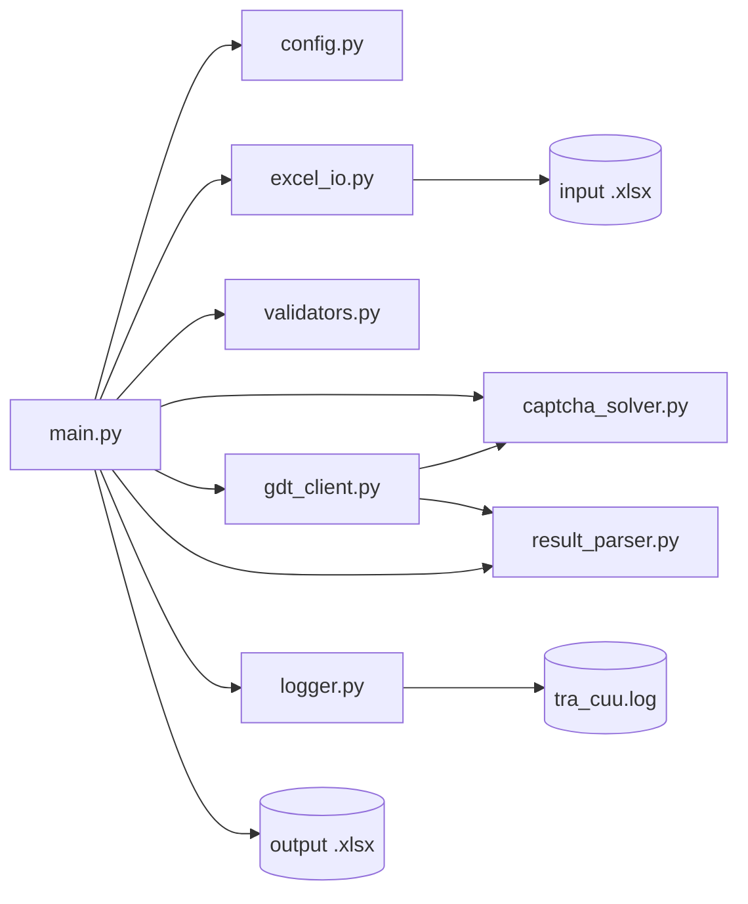

# Tài liệu thiết kế kỹ thuật (TDD): Ứng dụng tra cứu MST theo CCCD/CMND

> Tài liệu này cụ thể hoá các yêu cầu tại `ba-docs/thiet-ke-ung-dung-tra-cuu-mst.md` (mục 4–8) thành thiết kế kỹ thuật để lập trình bằng Python.

| Thông tin tài liệu | Nội dung |
|---|---|
| Ngôn ngữ triển khai | Python 3.10+ |
| Nền tảng | Windows (PowerShell) |
| Tài liệu nguồn | ba-docs/thiet-ke-ung-dung-tra-cuu-mst.md |
| Ngày cập nhật | 2026-09-19 |

## 1. Tổng quan kiến trúc



- **Nguyên tắc thiết kế**: mỗi module một trách nhiệm (SRP), không phụ thuộc vòng; `main.py` chỉ điều phối (orchestration), không chứa logic nghiệp vụ chi tiết.
- **Mẫu thiết kế**: Retry pattern cho gọi mạng và OCR; Repository-style đơn giản cho việc đọc/ghi Excel (tách khỏi logic tra cứu).

## 2. Cấu trúc thư mục

```
TraCuuMaSoThue/
├── ba-docs/
│   └── thiet-ke-ung-dung-tra-cuu-mst.md
├── docs/
│   └── tai-lieu-thiet-ke-ky-thuat.md      # tài liệu này
├── input/
│   └── danh_sach_cccd.xlsx
├── output/
│   └── ket_qua_tra_cuu.xlsx
├── src/
│   └── tracuumst/
│       ├── __init__.py
│       ├── config.py            # đọc cấu hình (CLI args + file .env/yaml)
│       ├── excel_io.py          # đọc input, ghi output Excel
│       ├── validators.py        # kiểm tra định dạng CCCD/CMND
│       ├── captcha_solver.py    # tải & nhận dạng CAPTCHA bằng OCR
│       ├── gdt_client.py        # điều khiển Selenium, submit form, retry
│       ├── result_parser.py     # bóc tách HTML kết quả trả về
│       ├── models.py            # dataclass: LookupRecord, LookupResult
│       └── logger.py            # cấu hình logging chung
├── tests/
│   ├── test_validators.py
│   ├── test_result_parser.py
│   └── fixtures/
│       └── sample_result.html
├── main.py
├── requirements.txt
└── .env.example
```

## 3. Mô hình dữ liệu (models.py)

```python
from dataclasses import dataclass, field
from enum import Enum

class TrangThai(str, Enum):
    THANH_CONG = "Thành công"
    KHONG_TIM_THAY = "Không tìm thấy"
    LOI = "Lỗi"
    DINH_DANG_KHONG_HOP_LE = "Định dạng không hợp lệ"

@dataclass
class LookupRecord:
    """Một dòng đầu vào cần tra cứu."""
    cccd: str
    dong_goc: int  # số thứ tự dòng trong Excel gốc, phục vụ resume/log

@dataclass
class LookupResult:
    cccd: str
    trang_thai: TrangThai
    mst: str | None = None
    ho_ten: str | None = None
    dia_chi: str | None = None
    co_quan_thue: str | None = None
    so_lan_thu_captcha: int = 0
    ghi_chu: str | None = None
```

## 4. Cấu hình (config.py)

Đọc cấu hình theo thứ tự ưu tiên: tham số CLI > file `.env` > giá trị mặc định.

| Tham số | Biến môi trường | Mặc định | Mô tả |
|---|---|---|---|
| `--input` | `INPUT_FILE` | `input/danh_sach_cccd.xlsx` | File Excel đầu vào |
| `--sheet` | `INPUT_SHEET` | `Sheet1` | Tên sheet |
| `--column` | `CCCD_COLUMN` | `CCCD` | Tên cột chứa CCCD/CMND |
| `--output` | `OUTPUT_FILE` | `output/ket_qua_tra_cuu.xlsx` | File Excel đầu ra |
| `--delay` | `REQUEST_DELAY_SECONDS` | `4` | Số giây delay giữa 2 lượt tra cứu (FR-10) |
| `--max-retry-network` | `MAX_RETRY_NETWORK` | `2` | Số lần thử lại khi lỗi kết nối/timeout |
| `--max-retry-captcha` | `MAX_RETRY_CAPTCHA` | `3` | Số lần thử lại khi OCR nhận dạng sai (FR-11, BR-Rule-04) |
| `--timeout` | `REQUEST_TIMEOUT_SECONDS` | `15` | Timeout cho mỗi thao tác chờ trang phản hồi |
| `--headless` | `HEADLESS_BROWSER` | `true` | Chạy Chrome ở chế độ headless hay không |
| `--log-file` | `LOG_FILE` | `tra_cuu.log` | Đường dẫn file log (FR-09) |

Sử dụng `argparse` cho CLI và `python-dotenv` để đọc `.env`.

## 5. Đọc & xác thực dữ liệu đầu vào

### 5.1. `excel_io.doc_input(path, sheet, column) -> list[LookupRecord]`
- Dùng `pandas.read_excel(path, sheet_name=sheet, dtype=str)` — **bắt buộc `dtype=str`** để tránh Excel/pandas tự ép số CCCD thành kiểu float (mất số 0 ở đầu, sai định dạng).
- Loại bỏ khoảng trắng hai đầu (`str.strip()`), loại dòng trống/NaN.
- Loại trùng lặp nhưng giữ lại số dòng gốc để đối chiếu khi ghi kết quả.

### 5.2. `validators.kiem_tra_dinh_dang(cccd: str) -> bool`
```python
import re

PATTERN_CCCD = re.compile(r"^\d{12}$")
PATTERN_CMND = re.compile(r"^\d{9}$")

def kiem_tra_dinh_dang(cccd: str) -> bool:
    return bool(PATTERN_CCCD.fullmatch(cccd) or PATTERN_CMND.fullmatch(cccd))
```
- Áp dụng FR-02 / BR-Rule-01: bản ghi không khớp regex → gán ngay `TrangThai.DINH_DANG_KHONG_HOP_LE`, không đưa vào hàng đợi tra cứu.

## 6. Module tự động đọc CAPTCHA (captcha_solver.py)

### 6.1. Trách nhiệm
- Tải ảnh CAPTCHA từ phần tử `` (`captcha.png?uid=...`) trên trang.
- Nhận dạng ký tự bằng OCR cục bộ, trả về chuỗi text.

### 6.2. Thiết kế hàm

```python
from selenium.webdriver.remote.webdriver import WebDriver

class CaptchaSolver:
    def __init__(self, engine: str = "ddddocr"):
        self._engine = engine
        self._ocr = self._load_engine(engine)

    def _load_engine(self, engine: str):
        if engine == "ddddocr":
            import ddddocr
            return ddddocr.DdddOcr(show_ad=False)
        raise ValueError(f"OCR engine không hỗ trợ: {engine}")

    def doc_captcha(self, driver: WebDriver, captcha_img_selector: str) -> str:
        """Chụp ảnh CAPTCHA hiện tại trên trang và trả về chuỗi ký tự nhận dạng."""
        img_element = driver.find_element("css selector", captcha_img_selector)
        image_bytes = img_element.screenshot_as_png
        return self._ocr.classify(image_bytes).strip()
```
- Lựa chọn thư viện: `ddddocr` (nhẹ, không cần huấn luyện, hỗ trợ tốt CAPTCHA số/chữ đơn giản). Dự phòng: `pytesseract` + tiền xử lý ảnh (`Pillow`, threshold nhị phân) nếu `ddddocr` không nhận dạng tốt loại CAPTCHA của trang.
- **Ghi chú kỹ thuật quan trọng**: cần khảo sát thực tế mẫu ảnh CAPTCHA của `mstcn.jsp` (độ nhiễu, font, có nhiễu đường kẻ hay không) trước khi chốt engine OCR; nếu độ chính xác thấp, cân nhắc huấn luyện model riêng bằng tập ảnh mẫu thu thập được.

## 7. Module điều khiển trình duyệt & tra cứu (gdt_client.py)

### 7.1. Cấu hình Selenium
```python
from selenium import webdriver
from selenium.webdriver.chrome.options import Options
from webdriver_manager.chrome import ChromeDriverManager
from selenium.webdriver.chrome.service import Service

def tao_driver(headless: bool = True) -> webdriver.Chrome:
    options = Options()
    if headless:
        options.add_argument("--headless=new")
    options.add_argument("--disable-gpu")
    options.add_argument("--window-size=1280,900")
    options.page_load_strategy = "eager"  # tránh treo/timeout khi điều hướng lại nhiều lần liên tiếp
    service = Service(ChromeDriverManager().install())
    return webdriver.Chrome(service=service, options=options)
```

### 7.2. Hàm tra cứu chính

```python
URL_TRA_CUU = "https://tracuunnt.gdt.gov.vn/tcnnt/mstcn.jsp"
SELECTOR_INPUT_MST = "input[name='mst']"        # xác nhận từ DOM thật: ô "Mã số thuế" hiển thị, dùng để nhập CCCD/CMND
SELECTOR_CAPTCHA_IMG = "img[src*='captcha.png']"
SELECTOR_INPUT_CAPTCHA = "input#captcha"          # xác nhận từ DOM thật: id="captcha", name="captcha"
SELECTOR_BUTTON_SUBMIT = "input.subBtn"           # không phải input[type=submit]; là button onclick="search()"

def tra_cuu(
    driver,
    solver: CaptchaSolver,
    cccd: str,
    max_retry_captcha: int,
    timeout: int,
) -> tuple[str, int]:
    """Trả về (html_ket_qua, so_lan_da_thu) hoặc raise LookupError khi hết lượt thử."""
    driver.get(URL_TRA_CUU)
    for lan_thu in range(1, max_retry_captcha + 1):
        _dien_form(driver, cccd, SELECTOR_INPUT_MST)
        ma_captcha = solver.doc_captcha(driver, SELECTOR_CAPTCHA_IMG)
        _dien_captcha(driver, ma_captcha, SELECTOR_INPUT_CAPTCHA)
        _submit(driver, SELECTOR_BUTTON_SUBMIT)  # trường hợp này nút không submit trực tiếp: click sẽ gọi JS search() -> document.myform.submit()

        if _captcha_hop_le(driver):  # kiểm tra thông báo lỗi "mã xác nhận không đúng"
            return driver.page_source, lan_thu

        _lam_moi_captcha(driver)  # click nút đổi ảnh CAPTCHA nếu có, hoặc load lại trang

    raise CaptchaError(f"Không nhận dạng đúng CAPTCHA sau {max_retry_captcha} lần")
```
- `_captcha_hop_le` bóc tách thông báo lỗi cụ thể trên trang (ví dụ chuỗi "mã xác nhận không đúng") để phân biệt với trường hợp "không tìm thấy dữ liệu" (CAPTCHA đúng nhưng không có MST).
- **Xác nhận từ khảo sát DOM thật (2026-09-19)**: form có `action=""`, `method="post"`, `name="myform"`, kèm hidden input `cm=cm`. Hàm JS `search()` chỉ trim giá trị `#captcha` rồi gọi `document.myform.submit()` (không AJAX). Có trường ẩn `name="cmt"` (label "Số chứng minh thư/Thẻ căn cước", `style="display:none"`) cần thử nghiệm thực tế xem CCCD/CMND nên điền vào `mst` hay `cmt` (hiện tại ưu tiên thử `mst` vì là ô hiển thị duy nhất có dấu `*` bắt buộc).
- **⚠️ Phát hiện quan trọng từ thử nghiệm thực tế (2026-09-19)**: điền `mst=<CCCD thật>` + CAPTCHA đúng (OCR nhận dạng đúng ngay lần đầu) → trang trả về đúng bảng kết quả thật (xác nhận selector `table.ta_border` là đúng, xem chi tiết cột ở mục 8). Tuy nhiên, khi thử với (a) CCCD giả định không tồn tại (`999999999999`) và (b) CCCD thật nhưng cố ý nhập sai CAPTCHA — **cả hai trường hợp trả về HTML giống hệt nhau**: toàn bộ trang chỉ là form rỗng (không có `<div id="resultContainer">`, không có thông báo lỗi dạng text, không có JS `alert()`). **Kết luận**: trang **không cung cấp cách phân biệt** giữa "sai CAPTCHA" và "không tìm thấy dữ liệu" qua nội dung HTML. Do đó `_captcha_hop_le()` cần đổi thiết kế: thay vì tìm thông báo lỗi, chỉ kiểm tra **có hay không `<div id="resultContainer">` chứa bảng `table.ta_border`**. Nếu không có, kết quả là "mơ hồ" (có thể do sai CAPTCHA HOẶC thật sự không có dữ liệu) — chiến lược xử lý: vẫn thử lại tối đa `max_retry_captcha` lần (vì có thể do OCR sai), nếu hết lượt vẫn không có bảng kết quả thì gán trạng thái `Không tìm thấy` (chấp nhận rủi ro nhỏ: một số trường hợp thực chất là "hết lượt OCR" sẽ bị gán nhầm thành "không tìm thấy" thay vì "Lỗi" — cần lưu ý này trong ghi chú kết quả).

### 7.3. Retry cho lỗi mạng
```python
import time
from selenium.common.exceptions import TimeoutException, WebDriverException

def tra_cuu_voi_retry(driver, solver, cccd, cfg) -> LookupResult:
    for lan in range(1, cfg.max_retry_network + 1):
        try:
            html, so_lan_captcha = tra_cuu(driver, solver, cccd, cfg.max_retry_captcha, cfg.timeout)
            ket_qua = result_parser.parse(html, cccd)
            ket_qua.so_lan_thu_captcha = so_lan_captcha
            return ket_qua
        except CaptchaError as e:
            return LookupResult(cccd=cccd, trang_thai=TrangThai.LOI, ghi_chu=str(e), so_lan_thu_captcha=cfg.max_retry_captcha)
        except (TimeoutException, WebDriverException) as e:
            if lan == cfg.max_retry_network:
                return LookupResult(cccd=cccd, trang_thai=TrangThai.LOI, ghi_chu=f"Lỗi kết nối: {e}")
            time.sleep(2)
    raise RuntimeError("Không thể xảy ra")  # an toàn cho type checker
```

## 8. Bóc tách kết quả (result_parser.py)

```python
from bs4 import BeautifulSoup
from .models import LookupResult, TrangThai

def parse(html: str, cccd: str) -> LookupResult:
    soup = BeautifulSoup(html, "html.parser")
    bang_ket_qua = soup.select_one("#resultContainer table.ta_border")  # đã xác nhận đúng trên dữ liệu thật (2026-09-19)

    if bang_ket_qua is None:
        return LookupResult(cccd=cccd, trang_thai=TrangThai.KHONG_TIM_THAY)

    hang = bang_ket_qua.select("tr")[1] if len(bang_ket_qua.select("tr")) > 1 else None
    if hang is None:
        return LookupResult(cccd=cccd, trang_thai=TrangThai.KHONG_TIM_THAY)

    # Cột thực tế: STT, MST, Tên người nộp thuế, Cơ quan thuế quản lý, Trạng thái MST (không có địa chỉ ở trang tra cứu cá nhân)
    cot = [td.get_text(strip=True) for td in hang.select("td")]
    return LookupResult(
        cccd=cccd,
        trang_thai=TrangThai.THANH_CONG,
        mst=cot[1] if len(cot) > 1 else None,
        ho_ten=cot[2] if len(cot) > 2 else None,
        dia_chi=None,  # trang tra cứu cá nhân không trả về địa chỉ
        co_quan_thue=cot[3] if len(cot) > 3 else None,
    )
```
- **Xác nhận từ thử nghiệm thực tế (2026-09-19)**: selector `#resultContainer table.ta_border` và 5 cột (STT, MST, Tên người nộp thuế, Cơ quan thuế quản lý, Trạng thái MST) đã được xác nhận chính xác trên dữ liệu thật. **Không có cột địa chỉ** (khác với giả định ban đầu) — trường `dia_chi` trong `LookupResult` sẽ luôn là `None` đối với trang tra cứu cá nhân (mstcn.jsp), giữ lại trường này trong model để tương thích nếu sau này mở rộng sang tra cứu tổ chức (mstdn.jsp).
- Fixture thử nghiệm dùng dữ liệu **tổng hợp (synthetic)**, không phải dữ liệu người thật: `tests/fixtures/sample_result_thanh_cong.html`, `tests/fixtures/sample_result_khong_tim_thay.html`. Dữ liệu thật thu được trong quá trình khảo sát (có tên người thật) đã được xóa khỏi workspace ngay sau khi xác nhận cấu trúc, không lưu vào repo (tuân thủ BR-05 về bảo vệ dữ liệu cá nhân).

## 9. Ghi kết quả & resume (excel_io.py)

```python
import pandas as pd
from pathlib import Path
from .models import LookupResult, TrangThai

def doc_ket_qua_da_co(output_path: str) -> dict[str, LookupResult]:
    """Trả về dict {CCCD: LookupResult} cho các bản ghi đã 'Thành công' ở file output cũ
    (phục vụ FR-08 / BR-Rule-03). Trả về LookupResult đầy đủ (không chỉ CCCD) để giữ
    nguyên vẹn dữ liệu cũ khi ghi đè file output ở lần chạy tiếp theo."""
    if not Path(output_path).exists():
        return {}
    df = pd.read_excel(output_path, dtype=str)
    if "CCCD/CMND" not in df.columns or "Trạng thái" not in df.columns:
        return {}
    da_xong: dict[str, LookupResult] = {}
    for _, hang in df.iterrows():
        if hang.get("Trạng thái") != TrangThai.THANH_CONG.value:
            continue
        cccd = hang["CCCD/CMND"]
        da_xong[cccd] = LookupResult(
            cccd=cccd, trang_thai=TrangThai.THANH_CONG,
            mst=hang.get("MST"), ho_ten=hang.get("Họ tên"),
            dia_chi=hang.get("Địa chỉ"), co_quan_thue=hang.get("Cơ quan thuế quản lý"),
            ghi_chu=hang.get("Ghi chú"),
        )
    return da_xong

def ghi_ket_qua(ket_qua: list[LookupResult], output_path: str) -> None:
    df = pd.DataFrame([{
        "CCCD/CMND": r.cccd,
        "MST": r.mst,
        "Họ tên": r.ho_ten,
        "Địa chỉ": r.dia_chi,
        "Cơ quan thuế quản lý": r.co_quan_thue,
        "Trạng thái": r.trang_thai.value,
        "Số lần thử CAPTCHA": r.so_lan_thu_captcha,
        "Ghi chú": r.ghi_chu,
    } for r in ket_qua])
    Path(output_path).parent.mkdir(parents=True, exist_ok=True)
    df.to_excel(output_path, index=False)
```
- Chiến lược resume đơn giản (không cần DB): đọc lại file output cũ, lấy các `LookupResult` đã `Thành công`. Khi bỏ qua một bản ghi ở lần chạy sau, **phải nối lại (carry-forward)** `LookupResult` cũ vào danh sách kết quả mới trước khi ghi đè file, nếu không các bản ghi đã hoàn thành trước đó sẽ biến mất khỏi file output (lỗi thực tế phát hiện khi kiểm thử Phase 5, xem `docs/ke-hoach-trien-khai.md`).

## 10. Ghi log (logger.py)

```python
import logging

def cau_hinh_logger(log_file: str) -> logging.Logger:
    logger = logging.getLogger("tracuumst")
    logger.setLevel(logging.INFO)
    handler = logging.FileHandler(log_file, encoding="utf-8")
    handler.setFormatter(logging.Formatter("%(asctime)s | %(levelname)s | %(message)s"))
    logger.addHandler(handler)
    logger.addHandler(logging.StreamHandler())
    return logger
```
- Mỗi lượt tra cứu ghi 1 dòng: `INFO | CCCD=xxxx | trang_thai=... | so_lan_captcha=... | thoi_gian_xu_ly=...s` (đáp ứng FR-09).

## 11. Luồng chính (main.py) — pseudo-code

```python
def main():
    cfg = config.load()
    logger = logger_module.cau_hinh_logger(cfg.log_file)

    ban_ghi = excel_io.doc_input(cfg.input, cfg.sheet, cfg.column)
    da_xong = excel_io.doc_ket_qua_da_co(cfg.output)

    solver = CaptchaSolver(engine="ddddocr")
    driver = gdt_client.tao_driver(headless=cfg.headless)

    ket_qua_tong: list[LookupResult] = []
    try:
        for rec in ban_ghi:
            if rec.cccd in da_xong:
                ket_qua_tong.append(da_xong[rec.cccd])  # carry-forward: giữ nguyên kết quả cũ
                continue  # resume: bỏ qua tra cứu lại bản ghi đã Thành công (BR-Rule-03)

            if not validators.kiem_tra_dinh_dang(rec.cccd):
                ket_qua_tong.append(LookupResult(rec.cccd, TrangThai.DINH_DANG_KHONG_HOP_LE))
                continue

            ket_qua = gdt_client.tra_cuu_voi_retry(driver, solver, rec.cccd, cfg)
            ket_qua_tong.append(ket_qua)
            logger.info("CCCD=%s | trang_thai=%s | so_lan_captcha=%s",
                        ket_qua.cccd, ket_qua.trang_thai.value, ket_qua.so_lan_thu_captcha)

            time.sleep(cfg.delay)  # FR-10: giới hạn tốc độ
    finally:
        driver.quit()
        excel_io.ghi_ket_qua(ket_qua_tong, cfg.output)

    logger.info("Hoàn tất: %d bản ghi", len(ket_qua_tong))

if __name__ == "__main__":
    main()
```

## 12. Thư viện & phiên bản đề xuất (requirements.txt)

```
pandas>=2.2
openpyxl>=3.1
selenium>=4.20
webdriver-manager>=4.0
beautifulsoup4>=4.12
ddddocr>=1.5
python-dotenv>=1.0
```

> Lưu ý: `ddddocr` phụ thuộc `onnxruntime`; trên một số máy Windows có thể cần cài thêm Visual C++ Redistributable. Nếu gặp lỗi cài đặt, dùng phương án dự phòng `pytesseract` (yêu cầu cài thêm Tesseract OCR engine ở hệ điều hành).

## 13. Kế hoạch kiểm thử (map với mục 10 của BA doc)

| Test case | File | Mô tả |
|---|---|---|
| `test_validators.py` | Unit test | Kiểm tra regex CCCD/CMND với các input hợp lệ/không hợp lệ, bao gồm số có khoảng trắng, số bị Excel ép kiểu float |
| `test_result_parser.py` | Unit test | Parse các file HTML mẫu (thành công / không tìm thấy) đã lưu sẵn trong `tests/fixtures/` |
| Kiểm thử thủ công E2E | Manual | Chạy `main.py` với 3–5 CCCD thật (có sự đồng ý), đối chiếu MST trả về với tra cứu thủ công trên trình duyệt |
| Kiểm thử resume | Manual | Dừng chương trình giữa chừng (Ctrl+C), chạy lại, xác nhận không tra cứu lại các bản ghi đã `Thành công` |
| Kiểm thử retry CAPTCHA | Manual/Mock | Giả lập OCR trả về sai liên tục, xác nhận dừng ở lần thứ 3 và gán trạng thái `Lỗi` |

## 14. Việc cần khảo sát thêm trước khi code (Open Items)

1. ~~Tên thuộc tính `name`/`id` thực tế của các input trên form `mstcn.jsp`~~ **Đã xác nhận (2026-09-19)**: `mst` (ô Mã số thuế, hiển thị), `fullname`, `address`, `cmt` (ẩn, label "Số chứng minh thư/Thẻ căn cước"), `captcha` (id=`captcha`), nút submit là `input.subBtn` với `onclick="search()"` (không phải `type=submit`).
2. ~~Cấu trúc HTML/CSS class của bảng kết quả~~ **Đã xác nhận (2026-09-19)**: `#resultContainer table.ta_border`, 5 cột STT/MST/Tên người nộp thuế/Cơ quan thuế quản lý/Trạng thái MST (xem mục 8).
3. ~~Cách trang hiển thị thông báo lỗi khi nhập sai CAPTCHA~~ **Đã khaso sát (2026-09-19) — kết quả quan trọng**: trang **không hiển thị thông báo lỗi dạng text** khi sai CAPTCHA; phản hồi giống hệt trường hợp "không tìm thấy dữ liệu" (chỉ trả về form rỗng, không có `#resultContainer`). Đã cập nhật thiết kế `_captcha_hop_le()` ở mục 7.2 để phản ánh hạn chế này.
4. ~~Có cơ chế đổi ảnh CAPTCHA hay phải tải lại toàn trang~~ **Đã xác nhận**: không có nút đổi CAPTCHA riêng trong form; cần `driver.get()` lại toàn trang (hoặc refresh) để lấy ảnh CAPTCHA mới khi cần thử lại.
5. Độ chính xác thực tế của `ddddocr`: đã thử 1 lần submit thật với CAPTCHA do OCR nhận dạng → **thành công ngay lần đầu** (trả về đúng bảng kết quả). Chưa thực hiện đánh giá thống kê đầy đủ trên 20–30 mẫu do cần hạn chế số lượng request tới máy chủ trong giai đoạn khảo sát (tuân thủ BR-04); sẽ theo dõi thêm tỷ lệ thành công thực tế qua log khi vận hành thử nghiệm diện rộng hơn ở Phase 5.
6. ~~Cần xác định CCCD/CMND nên điền vào ô `mst` hay `cmt`~~ **Đã xác nhận**: điền vào ô `mst` (hiển thị) cho kết quả đúng như mong đợi, không cần dùng ô `cmt` (ẩn).
7. **Mới phát sinh**: vì không thể phân biệt "sai CAPTCHA" và "không tìm thấy" qua HTML (xem mục 3 ở trên), cần cân nhắc thêm ở Phase 5: đo tỷ lệ "không tìm thấy" bất thường cao (có thể là dấu hiệu OCR sai nhiều hơn là thực sự không có dữ liệu) khi đánh giá kết quả vận hành thử nghiệm.
8. **Mới phát sinh (Phase 3, 2026-09-19)**: khi kiểm thử `gdt_client.py` bằng cách gửi nhiều request liên tục trong thời gian ngắn (phục vụ debug), máy chủ trả về trang lỗi `"Too Many Requests"` (không phải mã lỗi HTTP chuẩn mà là nội dung text trong `<body>`). Đã bổ sung `RateLimitError` + kiểm tra chuỗi này trong `_cho_trang_san_sang()`, xử lý bằng cách nghỉ lâu hơn (`delay * 5`) rồi thử lại trong giới hạn `max_retry_network`. **Bài học**: xác nhận thực tế rằng giới hạn tốc độ (FR-10, mặc định 3–5s) là bắt buộc, không chỉ là khuyến nghị lý thuyết — nếu chạy hàng loạt quá nhanh sẽ chắc chắn bị chặn.
